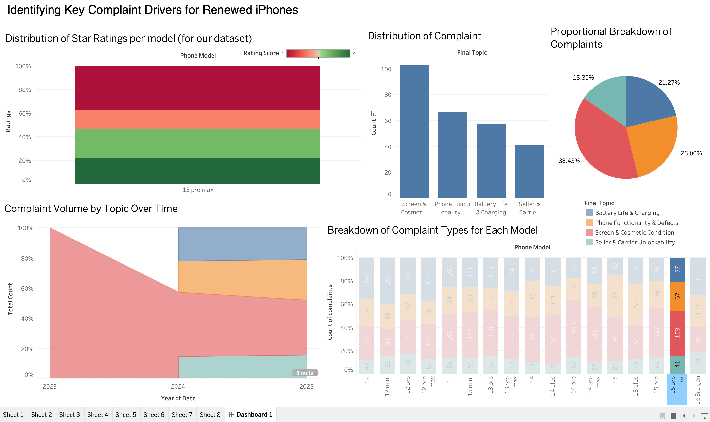

# Renewed iPhones Complaint Analysis: Uncovering Key Customer Pain Points

## Project Overview

This project aims to identify and analyze the primary complaint drivers for renewed iPhones based on customer review data. By transforming raw, unstructured text reviews into actionable insights, this analysis helps pinpoint specific issues related to different iPhone models, enabling targeted improvements for product management, quality control, and customer satisfaction. The project encompasses data extraction, robust preprocessing, exploratory data analysis (EDA), and interactive dashboard visualization.

## Key Features

* **Automated Review Extraction:** Efficiently gathers customer reviews.
* **Comprehensive Data Preprocessing:** Handles missing values, text cleaning, sentiment analysis, and feature engineering.
* **Complaint Topic Modeling:** Identifies recurring themes and categories of complaints.
* **Interactive Dashboard:** Provides a dynamic platform for stakeholders to explore complaint trends across models and time.
* **Actionable Insights:** Pinpoints specific models and complaint types requiring attention.

## Project Demo & Live Access

* **Demo Video:** [Click here to watch a demo of the interactive dashboard.](YOUR_DEMO_VIDEO_LINK_HERE)

## Dashboard Preview

Here's an overview of the interactive Tableau dashboard, showcasing the distribution of star ratings, complaint types, and trends over time:


## 💡 Interactive Exploration

The dashboard is designed for dynamic exploration. Clicking on a specific iPhone model (e.g., iPhone 12 Pro Max, iPhone 14 Pro Max, iPhone 15 Pro Max) highlights its specific complaint profile across all relevant charts.

* **iPhone 12 Pro Max Complaint Profile:**
    

* **iPhone 14 Pro Max Complaint Profile:**
    

* **iPhone 15 Pro Max Complaint Profile:**
    
## Project Flow & Methodology

The project followed a structured data science methodology:

### 1. Data Extraction & Collection

* Customer reviews for renewed iPhones were sourced from relevant platforms (e.g., e-commerce sites, tech forums).
* An automated script (details in the `clean_code.ipynb` notebook) was used to systematically extract review text, star ratings, and associated metadata.

### 2. Data Preprocessing & Cleaning

This crucial phase transformed raw, unstructured data into a clean, analysis-ready format. The detailed steps and code can be found in the associated notebooks (whose key outputs are shown below).

* **Handling Missing Values:** Identification and appropriate treatment of any missing data points to ensure data integrity.
* **Text Normalization:** Lowercasing, removal of punctuation, special characters, and numbers from review text to standardize the data.
* **Stop Word Removal:** Elimination of common words (e.g., "the", "a", "is") that do not contribute to meaningful insights.
* **Lemmatization/Stemming:** Reducing words to their base form to aggregate similar terms.
* **Sentiment Analysis:** Applying a sentiment model to quantify the emotional tone (positive, negative, neutral) of each review, providing a numerical 'Sentiment Score' and 'Negative Sentiment Rate'.
    
    *Description: Screenshot of the DataFrame snippet showing newly added sentiment scores and rates, as a result of the sentiment analysis step.*
* **Feature Engineering:**
    * **Complaint Topic Extraction:** Using techniques like TF-IDF and clustering (or a predefined dictionary approach) to group similar complaints into distinct "Final Topics" (e.g., Battery Life & Charging, Screen & Cosmetic Condition, Seller & Carrier Unreliability). This was a critical step in turning free-text complaints into categorizable data.
        
        *Description: A snippet of the DataFrame illustrating the 'Final Topic' column and its values, demonstrating the successful categorization of raw review text into actionable complaint types.*
    * **Model Name Cleaning:** Standardizing and shortening iPhone model names (e.g., "iPhone 12 Pro Max" to "12 Pro Max") for better readability and consistent categorization in visualizations.
        
        *Description: Screenshot of the Python code snippet for the `REPLACE()` function or a similar cleaning logic, along with its output demonstrating the cleaner, shorter model names used in the dashboard.*

### 3. Exploratory Data Analysis (EDA)

Initial analysis was performed to understand the data's characteristics and identify preliminary trends before creating the final dashboard.

* **Distribution of Star Ratings:** Analyzing the overall distribution of positive, neutral, and negative ratings across the dataset.
    
    *Description: A histogram or bar chart from the notebook showing the frequency of 1-star, 2-star, ..., 5-star ratings, indicating overall customer satisfaction levels.*
* **Complaint Volume Over Time:** Visualizing how the number of complaints has changed across months/years to identify any temporal patterns or emerging issues.
    
    *Description: A line or area chart from the notebook illustrating the trend of complaints from 2021 to 2025, highlighting periods of increased complaint activity.*
* **Top Complaint Categories:** Identifying the most frequent complaint topics across all models to understand the most significant pain points for renewed iPhones.
    
    *Description: A bar chart or table from the notebook summarizing the count or percentage of each 'Final Topic', providing an aggregate view of complaint types.*

### 4. Interactive Dashboard Development

The processed and analyzed data was then leveraged to create an interactive Tableau dashboard, facilitating stakeholder exploration and decision-making based on the insights derived from the data.

* **Data Connection:** The cleaned `dashboard_ready_data.csv` was connected to Tableau.
* **Visualization Design:** Charts were meticulously designed to address key business questions related to complaint drivers.
* **Interactivity:** Dashboard actions were implemented to allow users to filter the entire dashboard by selecting a specific iPhone model, enabling dynamic and granular analysis.

## Repository Contents

```text
renewed-iphones-complaint-analysis/
├── images/                           # Folder containing all screenshots used in this README.
│   ├── dashboard_overview.png
│   ├── dashboard_iphone_12_pro_max_filter.png
│   ├── dashboard_iphone_14_pro_max_filter.png
│   ├── dashboard_iphone_15_pro_max_filter.png
│   ├── notebook_sentiment_analysis_output.png
│   ├── notebook_topic_extraction_output.png
│   ├── notebook_model_cleaning_output.png
│   ├── notebook_eda_star_rating.png
│   ├── notebook_eda_complaint_volume_time.png
│   └── notebook_eda_top_complaints.png
├── clean_code.ipynb                  # notebook for initial data cleaning and preprocessing.
├── dashboard.twbx                    # Tableau Packaged Workbook.
├── dashboard_ready_data.csv          # Final data for dashboard use.
├── final.ipynb                       # Final EDA, sentiment, and topic modeling.
└── README.md                         # This file.
```

## How to Run & View

1.  **Clone the Repository:**
    ```bash
    git clone [https://github.com/saiyam-jain0/renewed-iphones-complaint-analysis.git](https://github.com/saiyam-jain0/renewed-iphones-complaint-analysis.git)
    cd renewed-iphones-complaint-analysis
    ```
2.  **View the Dashboard:**
    * Download the `dashboard.twbx` file.
    * Open it using Tableau Public Desktop Edition (free download available from Tableau's website) or Tableau Desktop.

## Technologies Used

* **Python:** The core language for data manipulation, analysis, and modeling.
    * `pandas`: For robust data cleaning, transformation, and structuring of review data.
    * `numpy`: For efficient numerical operations and array manipulations, often used in conjunction with `pandas`.
    * `re` (Regular Expressions): Python's built-in module used extensively for pattern-based text cleaning (e.g., removing punctuation, special characters, links).
    * `nltk` (Natural Language Toolkit): Essential for advanced text preprocessing steps such as tokenization, stop word removal, lemmatization (e.g., `WordNetLemmatizer`), and potentially lexicon-based sentiment analysis (e.g., `VADER`).
    * `textblob`: For straightforward, rule-based sentiment analysis.
    * `scikit-learn`: A fundamental machine learning library used for:
        * **Text Vectorization**: Converting raw text into numerical features using models like `TfidfVectorizer` or `CountVectorizer`
        * **Topic Modeling**: Implementing `LatentDirichletAllocation` (LDA) to uncover the hidden complaint themes from the review text.
    * `gensim`: A specialized library for scalable topic modeling (including LDA) and natural language processing tasks.
    * `matplotlib`: For creating foundational static plots and charts essential for Exploratory Data Analysis (EDA).
    * `seaborn`: Built upon Matplotlib, providing a high-level interface for generating aesthetically pleasing and informative statistical graphics for enhanced EDA.

* **Google Colaboratory (Colab) / Jupyter Notebook:** Used as the interactive development environment for coding, executing analytical steps, and documenting the data preprocessing and EDA workflows (`clean_code.ipynb`, `final.ipynb`). Google Colab was specifically utilized to leverage its GPU capabilities, which were essential for efficiently processing computationally intensive tasks and preventing CPU-related crashes.
* **Tableau Public Desktop Edition:** Utilized for designing and building the interactive, visually compelling dashboard (`dashboard.twbx`) that presents the final insights.
## About Me

* **Saiyam Jain**
* **Connect with me:** [LinkedIn](https://www.linkedin.com/in/saiyam-jain-368a23294/) | [GitHub](https://github.com/saiyam-jain0)

---
